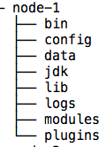

## Cluster
### Montage d'un cluster simple


###### 1- 
Sous le répertoire c:/elastic, créer un dossier que vous appellerez cluster-7.3.1

Copiez-y le contenu du dossier c:/elastic/7.3.1/elasticsearch (C'est le tar.gz ou le zip d'Elasticsearch que vous avez décompressé pour démarrer le tp) 

Renommer le en node-1

Refaites l'opération pour chaque noeud à créer. Au final, vous devriez avoir l'arborescence suivante





* Node-1
Ouvrir le fichier ./cluster-7.3.1/node-1/config/elasticsearch.yml 

Ajouter les properties suivante
```properties
discovery.seed_hosts: ["127.0.0.1:10300", "127.0.0.1:20300", "127.0.0.1:30300"]
cluster.initial_master_nodes: ["node-1", "node-2", "node-3"]

node.name: node-1
cluster.name: tp-elastic-cluster

http.port: 10200
transport.port: 10300

node.master: true 
node.data: false
cluster.remote.connect: false
```


* Node-2
Ouvrir le fichier ./cluster-7.3.1/node-2/config/elasticsearch.yml 

Ajouter les properties suivante
```properties
discovery.seed_hosts: ["127.0.0.1:10300", "127.0.0.1:20300", "127.0.0.1:30300"]
cluster.initial_master_nodes: ["node-1", "node-2", "node-3"]

node.name: node-2
cluster.name: tp-elastic-cluster

http.port: 20200
transport.port: 20300

node.master: true 
node.data: false 
cluster.remote.connect: false
```

* Node-3
Ouvrir le fichier ./cluster-7.3.1/node-3/config/elasticsearch.yml 

Ajouter les properties suivante
```properties
discovery.seed_hosts: ["127.0.0.1:10300", "127.0.0.1:20300", "127.0.0.1:30300"]
cluster.initial_master_nodes: ["node-1", "node-2", "node-3"]

node.name: node-3
cluster.name: tp-elastic-cluster

http.port: 30200
transport.port: 30300

node.master: true 
node.data: false 
cluster.remote.connect: false 
```

* Node-4
Ouvrir le fichier ./cluster-7.3.1/node-4/config/elasticsearch.yml 

Ajouter les properties suivante
```properties
discovery.seed_hosts: ["127.0.0.1:10300", "127.0.0.1:20300", "127.0.0.1:30300"]

node.name: node-4
cluster.name: tp-elastic-cluster

http.port: 40200
transport.port: 40300


node.master: false 
node.data: true 
```

###### 2- 

###### 3-

###### 4-
Vous avez monté un cluster contenant 3 master nodes et 1 data node. 
* Il y a assez de master nodes
* pour avoir une architecture tolérante aux pannes, on peut appliquer la règle 2*P + 1. Pour tolérer une panne, il faut donc 3 noeuds. Cette règle est valable pour les noeuds hébergeants des algoritmes distribués (Zookeeper, Système d'élection des masters dans Elasticsearch - master nodes dans notre cas, ...).