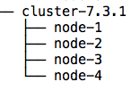

## Cluster
### Montage d'un cluster simple

Sous le répertoire c:/elastic, créer un dossier que vous appellerez cluster-7.3.1

Copiez-y le contenu du dossier c:/elastic/7.3.1/elasticsearch (C'est le tar.gz ou le zip d'Elasticsearch que vous avez décompressé pour démarrer le tp) 

Renommer le en node-1

Refaites l'opération pour chaque noeud à créer. Au final, vous devriez avoir l'arborescence suivante

Général

Détail

